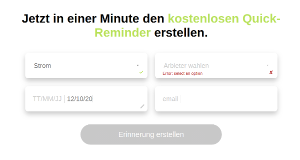

# A Slightly Different Form

In reality, a form field has four distinct states:
1. user has not entered field yet
2. user is editing the field
3. user left field, but the input is not valid
4. user left field, and the input is valid

So why not have a form that interacts with the user to show him the exact state he is in?

Many forms shows 'an error' in the field while the user is still editing the field. Better to show him that the form understands that the field is being edited.

This form shows a pencil, to symbolize editing, while the field is being edited:

## Build

The form is bulit with React using hooks.

The data in the first two fields are fetched from an external endpoint.

The options in the second dropdown change dynamically every time the user selects a different option from the first dropdpwn.
